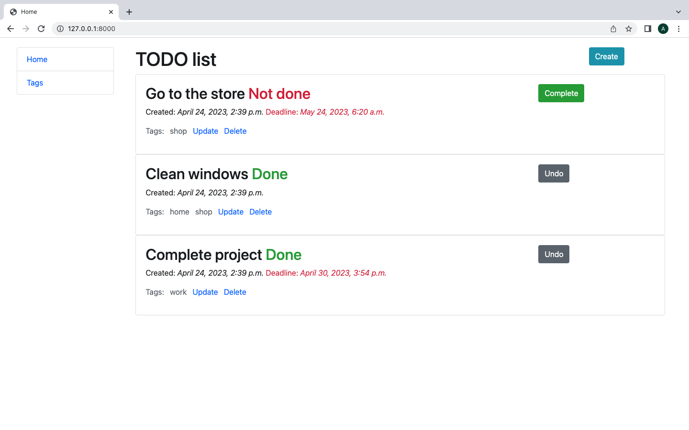
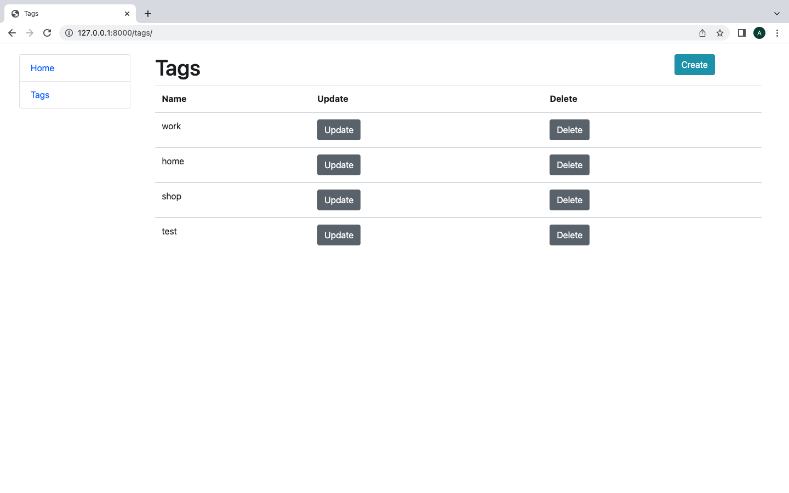
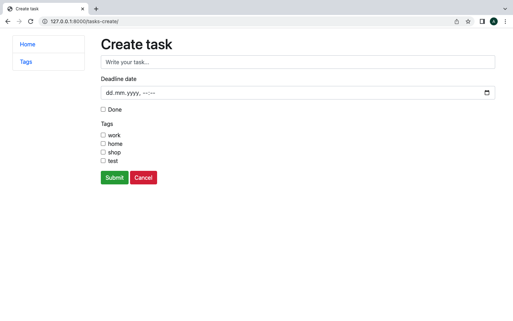
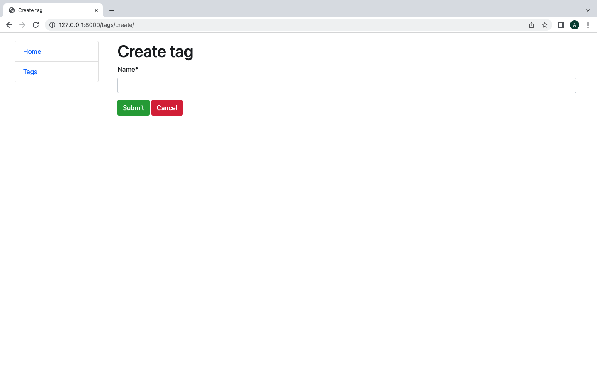
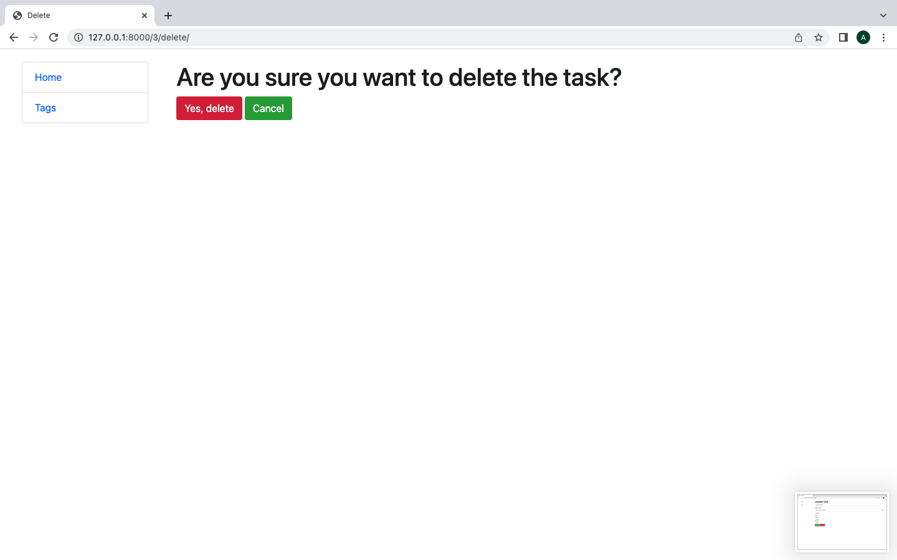

# TODO LIST site

## Todo list project

TODO list - it is a list of things you need to do or want to do.
With this site, you can easily control and not forget about your assignments.


## Installation

Python3 and Django must be already installed

````
git clone https://github.com/alina-boichenko/to-do-list.git
cd to_do_list
python3 -m venv venv
venv\Scripts\activate (on Windows)
source venv/bin/activate (on macOS)
pip install -r requirement.txt
python manage.py migrate
python manage.py runserver  # starts Django Server
````

## Features
- [x] Create new tasks and tags
- [x] Deadlines for list items 
- [x] The created tasks will be ordered from failed to completed and newest to oldest.

## Demo







